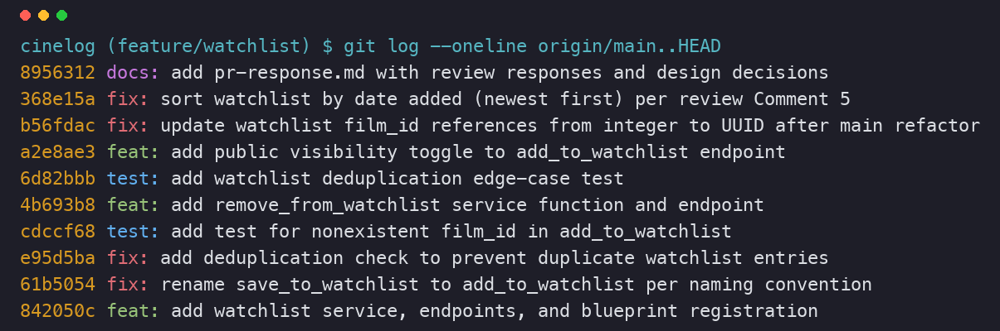

# PR Response Doc — CineLog Watchlist Feature

Thanks for the review. Here are my responses to all six comments, plus the
reasoning behind each change and my take on the two design questions (Comments 4
and 5). The stretch features and PR description are at the bottom.

---

## AI Usage

I used AI in three specific spots, all for orientation or checking my work, not
for the actual decisions:

1. To get oriented, I had it summarize `collection_service.py` and walk me
   through `add_to_collection()` before I read the comments — mainly to confirm
   what it returns for a missing film (`FilmNotFoundError`) and how it catches
   duplicates (`filter_by(user_id, film_id).first()` then raise). I checked that
   against the actual code before copying the pattern.
2. I asked what fixture setup `test_collection.py` uses so my test file would
   match. Then I just copied the fixtures and ran the suite to confirm.
3. After I'd written my Comment 4 and 5 answers, I asked it to argue against me
   and point out any tradeoff I skipped. On Comment 4 it brought up
   privacy-by-design / data-minimization expectations, which I hadn't spelled
   out, so I added the explicit `public` flag and the "when I'd flip the default"
   note below. On Comment 5 it argued alphabetical helps you find a known title;
   I'd already covered that (search/filter is the better tool), so I left my
   position and just made that point explicit. The reasoning below is mine.

---

## Comment 1 — Rename `save_to_watchlist()` → `add_to_watchlist()`

**What I did:** Renamed it to `add_to_watchlist()` and updated the call sites.
The other services use `verb_to_noun` (`add_to_collection`,
`remove_from_collection`), so `save_to_watchlist` was the odd one out.

**How I found the call sites:** `grep -rn "save_to_watchlist" --include="*.py" .`
turned up three: the definition in `watchlist_service.py`, and the import and
the call in `routes/watchlist/watchlist.py`. I changed all three.

**How I verified:** Re-ran the grep and got zero hits, then ran `pytest tests/`.
The route imports the function by name, so if I'd missed the import the app
wouldn't even start — the passing suite confirms it.

**Commit:** `fix: rename save_to_watchlist to add_to_watchlist per naming convention`

---

## Comment 2 — Deduplication

**What I did:** Added a duplicate check to `add_to_watchlist()`, copying how
`add_to_collection()` does it. Added an `AlreadyInWatchlistError` (same idea as
`AlreadyInCollectionError`) and, after the film-exists check:

```python
existing = WatchlistEntry.query.filter_by(
    user_id=user_id, film_id=film_id
).first()
if existing:
    raise AlreadyInWatchlistError(
        f"Film '{film_id}' is already on this user's watchlist"
    )
```

The endpoint turns that into a 409, same as the collection route does.

**What it does on a duplicate:** It looks for an existing `(user_id, film_id)`
row before inserting. If one's there, it raises instead of adding a second row,
so you can't get the same film on your watchlist twice. The endpoint returns 409
rather than blowing up with a 500.

**Where I looked first:** I read `add_to_collection()` in
`collection_service.py` (lines 47–53). Its check is a
`filter_by(user_id, film_id).first()` followed by raising, so I matched that
shape to keep the two services consistent. One difference: `CollectionEntry`
also has a DB-level `UniqueConstraint`. I stuck to the app-level check to match
the function logic, but a matching constraint on `WatchlistEntry` would be a
reasonable follow-up.

**How I verified:** Added `test_add_to_watchlist_duplicate_raises` (the second
stretch test below) — it adds the same film twice, expects the error, and checks
only one row exists. Also hit the endpoint by hand and got 201 then 409.

**Commit:** `fix: add deduplication check to prevent duplicate watchlist entries`

---

## Comment 3 — Missing test (nonexistent `film_id`)

**What I did:** Created `tests/test_watchlist.py` and added
`test_add_to_watchlist_nonexistent_film_raises` — it passes a `film_id` that
isn't in the DB and checks for `FilmNotFoundError`.

**What it checks:** That a missing film gives a clean `FilmNotFoundError`
instead of falling through to a database error. It uses a fake UUID
(`"00000000-0000-0000-0000-000000000000"`) as the id that won't exist.

**Modeled after:** `test_add_to_collection_nonexistent_film_raises` in
`test_collection.py`. I reused the same `app`/`sample_user` fixtures and the
same `pytest.raises(FilmNotFoundError)` structure so the two files line up.

**How I verified:** `pytest tests/test_watchlist.py -v` passes.

**Commit:** `test: add test for nonexistent film_id in add_to_watchlist`

---

## Comment 4 — Default visibility (`public=True`)

**My position:** Keep the default at `public=True`, but make it a real decision
instead of an accident by adding a `public` parameter callers can set (stretch 3
below).

**Why, for CineLog specifically:**

CineLog is a community film-tracking app — the whole point is seeing what other
people are into. A watchlist is a "here's what I want to watch" signal, which is
exactly the kind of low-stakes, recommendation-shaped data that a discovery feed
runs on ("3 people you follow want to watch *Arrival*"). If watchlists were
private by default, most people would never turn them on, and the feature that
makes the app worth using would sit empty.

The bigger reason is consistency with what's already here. Collections
(`get_collection` and its route) have no privacy flag at all — a user's
*watched-and-rated* history is already fully public through the API. That's
arguably more personal than a list of stuff they haven't gotten to yet. Making
watchlists private-by-default while collections stay wide open would be a weird,
hard-to-explain split. Public keeps the watchlist in line with how CineLog
already treats user data.

So I'm optimizing for a growing community app where content being visible by
default is what drives the discovery loop, and nobody has to flip a switch to
take part.

**The tradeoff:** Public-by-default gives up some privacy. The other choice —
private by default, opt in to share — is the safer, privacy-first stance, and
it's the right call if CineLog ever has minors on it, operates somewhere with
GDPR/CCPA rules, or holds lists that could be sensitive. That version fails safe;
mine fails open. I think open is right for CineLog *today* given the
community goal and the already-public collections, but I'd switch the default to
private the moment we onboard minors or a regulated market. The `public` flag I
added means that switch is a one-line change, and it makes today's default a
deliberate, written-down choice — which is what you were asking for.

---

## Comment 5 — Sort order

**My position:** I agree with you — sort by date added, newest first. I went
ahead and changed it (`WatchlistEntry.date_added.desc()` instead of the old
`Film.title.asc()`).

**Why:** A watchlist is a running queue of what you want to watch next, not a
reference catalog you look things up in. When someone opens it, they're usually
asking "what did I just add" or "what should I watch," which is a recency
question. Newest-first puts the thing they were just thinking about at the top.
Alphabetical doesn't line up with how anyone picks a movie — *Alien* isn't a
better pick than *Zodiac* because of the first letter.

**On your point ("most users want to see what they added recently"):** Agreed,
and I'd add there's evidence for it right in the codebase: `get_collection()`
already sorts `date_added.desc()` (`collection_service.py:102`) and its route
even says "sorted newest-first." So date-added is already the house style for
user lists here — the alphabetical watchlist was the outlier. Matching it means
collection and watchlist behave the same way, which is one less thing for a user
to figure out.

**The one case for alphabetical** is finding a specific title in a long list.
But sorting the whole list alphabetically is a clumsy way to solve that — as
watchlists grow the real answer is search/filter (the films API already filters
by genre and year), not making everyone pay for an ordering they didn't ask for.
So recency stays the default, and "find this one film" is a lookup problem we
solve separately. I added `test_get_watchlist_returns_newest_first` (based on the
collection test) so this doesn't regress.

**Commit:** `fix: sort watchlist by date added (newest first) per review Comment 5`

---

## Comment 6 — Rebase on updated `main` (integer → UUID)

**What conflicted:** The refactor that merged to `main`
(`refactor: migrate film IDs from integer to UUID`) changed `Film.id` and
`CollectionEntry.film_id` from `db.Integer` to `db.String(36)`, and as part of
that it also removed `WatchlistEntry` from `models.py`. My branch was still
built on integer film IDs. When I ran `git rebase origin/main`, git didn't stop
on a textual conflict — my commits only touched the service, routes, and tests,
not the model lines main changed — so the three-way merge just took main's
`models.py`, which no longer had `WatchlistEntry`. That left a broken state: the
service imported a model that didn't exist, and `pytest` failed to even collect
with `ImportError: cannot import name 'WatchlistEntry' from 'models'`.

**How I fixed it:** In its own commit I put `WatchlistEntry` back, this time with
`film_id = db.Column(db.String(36), db.ForeignKey("film.id"))` so it matches the
new UUID `Film.id` instead of the old `db.Integer`. While I was there I also:
- added the `Film` ↔ `WatchlistEntry` relationship so `get_watchlist()`'s
  `entry.film` works (it needs the ORM relationship, same as `CollectionEntry`),
  and
- updated the `film_id (int)` docstrings in the service and the
  `{"film_id": <int>}` example in the route to say UUID.

**How I confirmed it's clean:**
- `git log --merges origin/main..HEAD` prints nothing — no merge commits.
- `git merge-base HEAD origin/main` matches `origin/main`'s HEAD, so the branch
  sits right on top of updated main.
- `grep -rn "db.Integer" models.py services/` shows no integer film IDs left in
  watchlist code.
- `pytest tests/ -v` — all 12 pass, and I hit the live endpoints with real UUIDs
  (add → 201, duplicate → 409, bad id → 404, remove → 200).

**Commit:** `fix: update watchlist film_id references from integer to UUID after main refactor`

---

## Stretch Features

### Stretch 1 — `remove_from_watchlist(user_id, film_id)`
Added it following `remove_from_collection()`. It looks up the
`(user_id, film_id)` entry; if the film isn't on the watchlist it raises
`NotInWatchlistError` (matching `NotInCollectionError`) instead of quietly doing
nothing, otherwise it deletes the row and returns `True`. Exposed as
`DELETE /watchlist/<user_id>/remove` (200, or 404 if it's not there), same shape
as the collection route. Tests: `test_remove_from_watchlist_deletes_entry` and
`test_remove_from_watchlist_not_present_raises`.
**Commit:** `feat: add remove_from_watchlist service function and endpoint`

### Stretch 2 — A second test I wasn't asked for
`test_add_to_watchlist_duplicate_raises`. I picked the duplicate-add case because
it's the exact thing the Comment 2 dedup guard protects, and it's the kind of
bug that would slip through quietly — someone could drop the check later and the
happy-path test would still pass. It checks both that the error is raised and
that only one row exists, so it'd catch a silent duplicate even if the exception
changed. Based on `test_add_to_collection_duplicate_raises`.
**Commit:** `test: add watchlist deduplication edge-case test`

### Stretch 3 — Visibility toggle on the endpoint
Added a `public` parameter to `add_to_watchlist(user_id, film_id, public=True)`
and had the endpoint read `data.get("public", True)`. Default is `True` (the
Comment 4 decision). To use it: `POST /watchlist/<user_id>/add` with
`{"film_id": "<uuid>", "public": false}` adds it privately; leaving `public` out
(or sending `true`) adds it publicly. This is what makes the default a real
choice instead of an inherited one. Tests: `test_add_to_watchlist_defaults_public`
and `test_add_to_watchlist_respects_public_false`.
**Commit:** `feat: add public visibility toggle to add_to_watchlist endpoint`

---

## Final Commit History

```
docs: add pr-response.md with review responses and design decisions
fix: sort watchlist by date added (newest first) per review Comment 5
fix: update watchlist film_id references from integer to UUID after main refactor
feat: add public visibility toggle to add_to_watchlist endpoint
test: add watchlist deduplication edge-case test
feat: add remove_from_watchlist service function and endpoint
test: add test for nonexistent film_id in add_to_watchlist
fix: add deduplication check to prevent duplicate watchlist entries
fix: rename save_to_watchlist to add_to_watchlist per naming convention
feat: add watchlist service, endpoints, and blueprint registration
```

10 commits, all conventional format (`feat:` / `fix:` / `test:` / `docs:`), one
logical change each, no merge commits — rebased linearly on top of `main`. (The
top `docs` commit's short hash shifts by one, since this file and the screenshot
are part of that commit.)



---

## PR Description

### What the watchlist feature does
The watchlist lets a CineLog user save films they want to watch — separate from
the collection, which is films they've already watched. It adds a
`WatchlistEntry` model, a `watchlist_service` (`add_to_watchlist`,
`remove_from_watchlist`, `get_watchlist`), and REST endpoints under `/watchlist`:

- `GET  /watchlist/<user_id>` — list a user's watchlist (newest added first).
- `POST /watchlist/<user_id>/add` — add a film. Body: `{"film_id": "<uuid>",
  "public": true}` (`public` optional, defaults to `true`). Returns 201; 404 if
  the film doesn't exist; 409 if it's already on the watchlist.
- `DELETE /watchlist/<user_id>/remove` — remove a film. Body:
  `{"film_id": "<uuid>"}`. Returns 200; 404 if it isn't on the watchlist.

Adds are de-duplicated, and film IDs are UUIDs to match main's refactor.

### Design decisions made
1. **Default visibility = `public=True`.** CineLog is a community app and a
   watchlist is low-stakes intent data, so public-by-default feeds discovery and
   stays consistent with the already-public collection. Added a `public` flag so
   the default is deliberate and privacy is one field away. (Full reasoning:
   Comment 4 above.)
2. **Sort order = date added, newest first.** A watchlist is a queue of what you
   want to watch next, so recency matches how people read it — and it matches
   `get_collection()`'s existing `date_added.desc()` order. (Full reasoning:
   Comment 5 above.)

### How to manually test the feature
```bash
# 1. Set up
python -m venv .venv && source .venv/bin/activate
pip install -r requirements.txt

# 2. Run the automated suite (12 tests, all green)
pytest tests/ -v

# 3. Start the app
python app.py                     # serves http://127.0.0.1:5000

# 4. Seed a user + film to get real UUIDs (in a second shell), then:
USER=<user_uuid>
FILM=<film_uuid>

# add (expect 201, "public": true)
curl -s -X POST http://127.0.0.1:5000/watchlist/$USER/add \
     -H 'Content-Type: application/json' -d "{\"film_id\": \"$FILM\"}"

# add the same film again (expect 409 Conflict — dedup)
curl -s -o /dev/null -w '%{http_code}\n' -X POST \
     http://127.0.0.1:5000/watchlist/$USER/add \
     -H 'Content-Type: application/json' -d "{\"film_id\": \"$FILM\"}"

# add a nonexistent film (expect 404)
curl -s -o /dev/null -w '%{http_code}\n' -X POST \
     http://127.0.0.1:5000/watchlist/$USER/add \
     -H 'Content-Type: application/json' -d '{"film_id": "no-such-uuid"}'

# view the watchlist (newest added first)
curl -s http://127.0.0.1:5000/watchlist/$USER

# add privately (expect 201, "public": false)
curl -s -X POST http://127.0.0.1:5000/watchlist/$USER/add \
     -H 'Content-Type: application/json' \
     -d "{\"film_id\": \"$FILM\", \"public\": false}"

# remove it (expect 200), then remove again (expect 404)
curl -s -o /dev/null -w '%{http_code}\n' -X DELETE \
     http://127.0.0.1:5000/watchlist/$USER/remove \
     -H 'Content-Type: application/json' -d "{\"film_id\": \"$FILM\"}"
```
